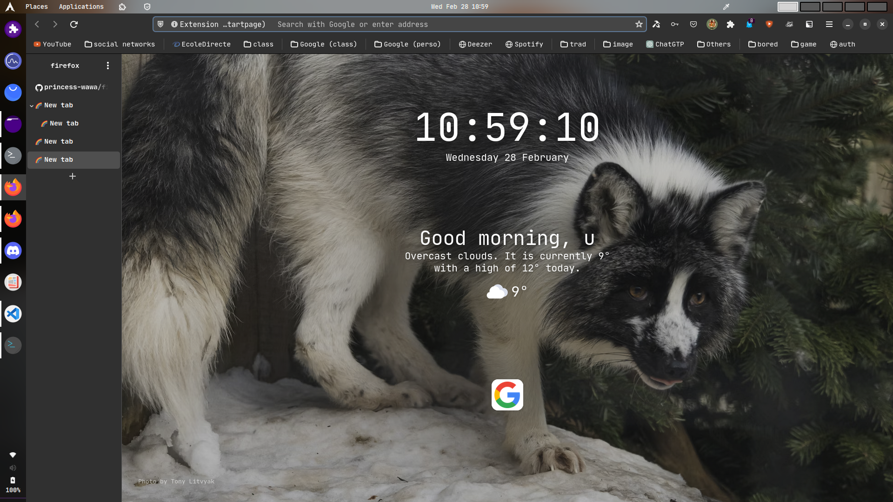

# Firefox GNOME theme

[](https://github.com/rafaelmardojai/firefox-gnome-theme/blob/master/LICENSE)

<br>

**A GNOME theme for Firefox**

This theme follows latest GNOME Adwaita style.

> ### Disclaimer:
> Be aware that this theme might do things that are not supported by upstream Firefox. If you face an issue while using this theme, report it here first or test if it is reproducible in vanilla Firefox.
>
> If you are a software distribution maintainer, please do not ship this changes by default to your users unless you made extremely clear that they are using a modified version of Firefox UI.



## Description

This is a bunch of CSS code to make Firefox look closer to GNOME's native apps.

## Installation scripts

If you want to use other version of the theme than the stable one you can manually download the theme and run its install scripts.

First you need to grab a fresh copy of the theme repository by cloning it with git.

1. Clone this repo and enter folder:

	```sh
	git clone https://github.com/princess-wawa/firefox-new-gnome-theme.git
	cd firefox-new-gnome-theme
	```

### Auto install script

This script will look for Firefox profiles from various known locations (`~/.mozilla/firefox/`, Flatpak, Snap, etc) and install the theme in each one. 
It will also enable a color variant for your GTK theme if it exists.

You can execute it by running:

```sh
./scripts/auto-install.sh
```

### Manual install script

This script will only install the theme into the profiles found in the default Firefox folder `~/.mozilla/firefox/`. The script accepts various flags to change its behavior.

Here are some examples of how to use it:

```sh
./scripts/install.sh # Standard
./scripts/install.sh -p pc8577yz.default-release # Only install in a profile named pc8577yz.default-release
./scripts/install.sh -f ~/.var/app/org.mozilla.firefox/.mozilla/firefox # Flatpak
./scripts/install.sh -f ~/snap/firefox/common/.mozilla/firefox #Snap
```

#### Script options
- `-f <firefox_folder_path>` *optional*
	- Set custom Firefox folder path, for example `~/.mozilla/icecat/`.
	- Default: `~/.mozilla/firefox/`

- `-p <profile_name>` *optional*
	- Set custom profile name, for example `e0j6yb0p.default-nightly`.
	- Default: All the profiles found in the firefox folder

- `-t <theme_name>` *optional*
	- Set the colors used in the theme.
	- Default: Adwaita.
	- Options: `adwaita`, `maia`.

<details>
    <summary>Advanced notes</summary>
  
### Advanced notes

If you want to checkout the theme version tag matching you Firefox version you can run:

```sh
git checkout v$(firefox --version | cut -d ' ' -f 3 | cut -d '.' -f 1) # Using Firefox version
```
</detail>

## Required Firefox preferences
We provide a **user.js** configuration file in `configuration/user.js` that enable some preferences required by this theme to work.

You should already have this file installed if you followed one of the installation methods, but in any case be sure this preferences are enabled under `about:config`:

- `toolkit.legacyUserProfileCustomizations.stylesheets`

	This preference is required to load the custom CSS in Firefox, otherwise the theme wouldn't work.

- `svg.context-properties.content.enabled`

	This preference is required to recolor the icons, otherwise you will get black icons everywhere.

> For other non essential preferences checkout `configuration/user.js`.

## for the sidebar i recommend using [Tree Style Tab](https://addons.mozilla.org/en-US/firefox/addon/tree-style-tab/)
with this custom css in the advanced section
```css
body {
    font-weight: bold;
}

tab-item:hover {
  --tab-margin-left: 10px;
    box-shadow: none
}
:root.left tab-item:hover tab-closebox {
  visibility: visible;
}

:root.left tab-item tab-closebox {
  visibility: hidden;
}

tab-item{
  --tab-margin-bottom: -6px;
}

tab-item tab-item-substance{
  height:45px;
}
 
tab-item.active .background {
  box-shadow: none;
}
```

## Uninstalling
1. Go to your profile folder. (Go to `about:support` in Firefox > Application Basics > Profile Directory > Open Directory)
2. Remove `chrome` folder.
3. Remove the unwanted preferences from your `user.js` inside your profile folder. The install script append the needed prefs in that file, you can check what preferences does it append by checking `configuration/user.js` in this repo.

## Enabling optional features
Optional features can be enabled by creating new `boolean` preferences in `about:config`.

1. Go to the `about:config` page
2. Type the key of the feature you want to enable
3. Set it as a `boolean` and click on the add button
4. Restart Firefox

### Features

- **Hide single tab** `gnomeTheme.hideSingleTab`

	Hide the tab bar when only one tab is open.

	> **Note:** You should move the new tab button out of the tabbar or it will be hidden when there is only one tab. You can rearrange the toolbars doing a right-click on any toolbar and selecting "Customize Toolbar…".

	> **Note 2:** This feature doesn't work when tabs are hidden, like when using the Simple Tab Groups extension. In this case, there's no way to tell from CSS that there's only one visible tab.

- **Normal width tabs** `gnomeTheme.normalWidthTabs`

	Use normal width tabs as default Firefox.

- **Swap tab close button position** `gnomeTheme.swapTabClose`

	By default the tab close buttons follows the position of the window controls, this preference reverts that behavior.

- **Bookmarks toolbar under tabs** `gnomeTheme.bookmarksToolbarUnderTabs`

	Move Bookmarks toolbar under tabs.

- **Active tab contrast** `gnomeTheme.activeTabContrast`

	Add more contrast to the active tab.

- **Close only selected tabs** `gnomeTheme.closeOnlySelectedTabs`

	Show the close button on the selected tab only.

- **System icons** `gnomeTheme.systemIcons`

	Use system theme icons instead of Adwaita icons included by theme.

	> **Note:** This feature has a [known color bug](#icons-color-broken-with-system-icons).

- **Symbolic tab icons** `gnomeTheme.symbolicTabIcons`

	Make all tab icons look kinda like symbolic icons.

- **Hide WebRTC indicator** `gnomeTheme.hideWebrtcIndicator`

	Hide redundant WebRTC indicator since GNOME provides their own privacy icons in the top right.

- **Hide unified extensions button** `gnomeTheme.hideUnifiedExtensions`

	Hide unified extensions button from the navbar, you can also use `extensions.unifiedExtensions.enabled` instead, which is only going to work till Firefox 111.

- **Drag window from headerbar buttons** `gnomeTheme.dragWindowHeaderbarButtons`

	Allow dragging the window from headerbar buttons.

	> **Note:** This feature is BUGGED. It can activate the button with unpleasant behavior.

- **Tabs as headerbar** `gnomeTheme.tabsAsHeaderbar`

	Place the tabs on the top of the window, and use the tabs bar to hold the window controls, like Firefox's standard tab bar.
	
	> **Note:** Enabling with `gnomeTheme.hideSingleTab` will replace the single tab with a title bar.

### Extensions support

We also have optional features to enable support for some Firefox extensions.

> **Be aware that extensions support are maintained by the community, so requests to support new extensions are not allowed and the included ones could get broken until someone shows up to fix them.**

- **Tab center reborn support** `gnomeTheme.extensions.tabCenterReborn`

	Enable the vertical tab trough the extension : [Tab Center Reborn](https://addons.mozilla.org/en-US/firefox/addon/tabcenter-reborn/).

	> **Note:** You also need to copy the contents of the file `configuration/extensions/tab-center-reborn.css` into the settings page of Tabcenter-reborn..\
	> **Note2:** You can also maintain the vertical tab always open with `gnomeTheme.extensions.tabCenterReborn.alwaysOpen`
 	> **Note2:** You can disable animation by disabling animation into the extension and adding the flags `gnomeTheme.extensions.tabCenterReborn.animationDisabled`
	
## Known bugs

### CSD have sharp corners
See upstream [bug](https://bugzilla.mozilla.org/show_bug.cgi?id=1408360).

#### Wayland fix:
1. Go to the `about:config` page
2. Search for the `layers.acceleration.force-enabled` preference and set it to true.
3. Now restart Firefox, and it should look good!

#### X11 fix:
1. Go to the `about:config` page
2. Type `mozilla.widget.use-argb-visuals`
3. Set it as a `boolean` and click on the add button
4. Now restart Firefox, and it should look good!

### Icons color broken with System icons
Icons might appear black where they should be white on some systems. I have no idea why, but you can adjust them directly in the `system-icons.css` file, look for `--gnome-icons-hack-filter` & `--gnome-window-icons-hack-filter` vars and play with css filters.

## Development

If you wanna mess around the styles and change something, you might find these
things useful.

To use the Inspector to debug the UI, open the developer tools (F12) on any
page, go to options, check both of those:

- Enable browser chrome and add-on debugging toolboxes
- Enable remote debugging

Now you can close those tools and press Ctrl+Alt+Shift+I to Inspect the browser
UI.

Also you can inspect any GTK3 application, for example type this into a terminal
and it will run Epiphany with the GTK Inspector, so you can check the CSS styles
of its elements too.

```sh
GTK_DEBUG=interactive epiphany
```

Feel free to use any parts of my code to develop your own themes, I don't force
any specific license on your code.

## Credits
Developed by **[Rafael Mardojai CM](https://github.com/rafaelmardojai)** and [contributors](https://github.com/rafaelmardojai/firefox-gnome-theme/graphs/contributors). Based on **[Luna Kurame](https://github.com/lunakurame/firefox-gnome-theme)**'s original work, modified by **[princess-wawa](https://github.com/princess-wawa)**

